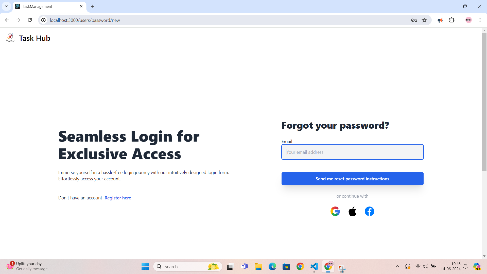
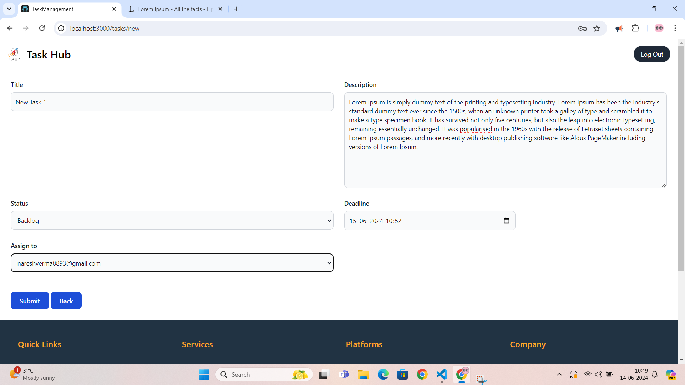

## Live Demo

You can access the live demo of the application [here](https://task-management-yclf.onrender.com/).


# Task Management Application


This is a robust task management application built with Ruby on Rails and PostgreSQL, designed to streamline task organization and enhance team productivity.

## Table of Contents

- [Features](#features)
- [Prerequisites](#prerequisites)
- [Setup](#setup)
- [Usage](#usage)
- [Testing](#testing)
- [Deployment](#deployment)
- [Contributing](#contributing)
- [License](#license)

## Features

- **User Authentication:** Utilizes Devise for secure user authentication and management.
- **Task Management:** Create, update, and delete tasks with ease. Tasks can be categorized into Backlog, In-progress, and Done statuses.
- **Task Deadlines:** Set deadlines for tasks and receive email reminders to stay organized.
- **Responsive UI:** Ensures a seamless user experience across devices.

## Prerequisites

Before running the application, ensure you have the following installed:
- Ruby (version >= 3.3.0)
- Rails (version >= 7.1.3)
- PostgreSQL
- Redis

If Redis is not installed, you can install it using the following commands (for Ubuntu):
```bash
sudo add-apt-repository ppa:redislabs/redis
sudo apt-get update
sudo apt-get install redis-server
```

## Setup
Clone the Repository:

```
git clone https://github.com/yourusername/task-management-application.git
cd task-management-application
```

Install Dependencies:

```
bundle install
```
Database Setup:
```
rails db:create
rails db:migrate
rails db:seed
```
Environment Configuration:

Create a .env file in the root directory.
Add necessary environment variables (e.g., database credentials, Redis URL, Devise secret key).

Start the Server Using This:

```
./bin/dev
or
rails s
```

Run Redis Server:
```
redis-server
```

## Usage

Once the server is running, you can access the application at http://localhost:3000.

Sign Up / Login: Use the authentication system to create an account or log in.
Create Tasks: Navigate to the task management section to create, update, or delete tasks.
Set Deadlines: Assign deadlines to tasks and receive email reminders.


## Testing
To run the test suite, use the following command:
```
bundle exec rspec
```


## Deployment

- **Precompile Assets:**
```
rails assets:precompile
```


- **Migrate Database:**
```
rails db:migrate RAILS_ENV=production
```

- **Start the Application:**
```
rails server -e production
```

## Contributing
  We welcome contributions to enhance the application. Please follow these steps:

  
  - **Fork the repository.**
  - **Create a new branch (git checkout -b feature-branch).**
  - **Make your changes.**
  - **Commit your changes (git commit -m 'Add new feature').**
  - **Push to the branch (git push origin feature-branch).**
  - **Open a pull request.**

## Screenshots

Here are some screenshots of the application:

### Registration Page


### Login Page


### Forgot Password


### Dashboard After Login


### Creating a New Task


### Task Details


### Task Modal Popup


### Calendar Integration

  

## License

This project is licensed under the MIT License. See the LICENSE file for details.

